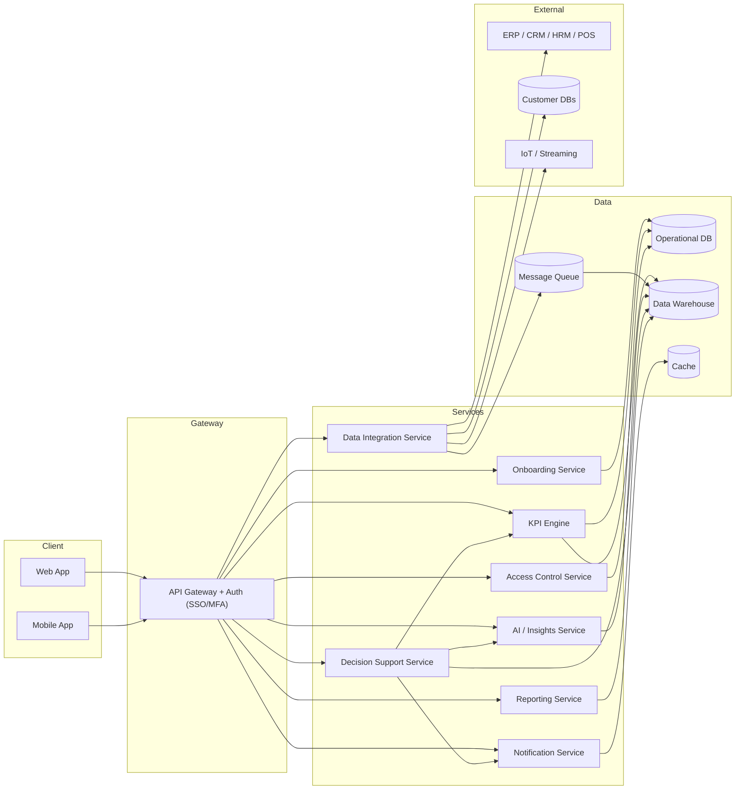
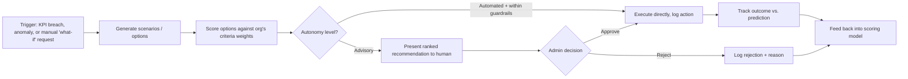

# KPI Integration Platform — Onboarding Flow Review & System Blueprint

## 1. Summary

The original draft has the right instincts: industry-aware setup, flexible KPI selection, multi-source data
integration, and phased AI autonomy. But as written, several steps are ambiguous, some are duplicated, and a
few critical pieces are missing entirely — most importantly, KPI selection has no way to define what a
"critical breach" actually *is*, and data source connection has no credential or field-mapping step, without
which no data can actually flow into the system.

Below: the specific issues, a corrected step-by-step onboarding flow, and a system blueprint (architecture,
data model, modules, security) to build against.

---

## 2. Issues Found in the Original Draft

| # | Issue | Fix |
|---|-------|-----|
| 1 | "After second attempt super admin can enter profile details" — unclear whether this means failed login attempts (a lockout concept) or just the second time logging in. | Replace with a standard flow: temp credentials → forced password reset on first login → optional MFA enrollment → profile setup. Don't tie profile access to a login "attempt count." |
| 2 | Industry is asked twice — once as its own step, once again inside "What is your industry?" in the org details form. | Merge into one step. Ask organization details first, with industry selection (primary + additional) as part of that same form. |
| 3 | KPIs can be selected, but nothing defines target values or thresholds. | You can't fire "critical KPI breach" notifications later without this. Add a KPI target/threshold sub-step immediately after KPI selection (target value, warning band, critical band, direction of "good"). |
| 4 | "Areas to monitor" checklist is shown as a static manufacturing example, with no rule for other industries or multi-industry orgs. | Needs a per-industry template with a merge rule for organizations that selected multiple industries (union of areas, de-duplicated). |
| 5 | Data source selection has no credential capture, connection test, or field mapping. | Add: (a) auth/credential step per source (API key, OAuth, DB connection string — stored encrypted), (b) "Test Connection" action before proceeding, (c) field mapping step so raw source fields map to KPI variables. Without this, KPIs can't actually compute. |
| 6 | Refresh frequency is only mentioned for ERP. | Refresh frequency should be configurable **per data source**, not just ERP — a PostgreSQL connection and an IoT stream have very different realistic cadences. |
| 7 | "Data validation (Free – Open metadata, Paid – Atlan)" conflates two different things. | OpenMetadata/Atlan are data **cataloging & governance** tools, not validation engines. Separate this into two concerns: (a) data quality rules (nulls, duplicates, schema checks — build this yourself), and (b) an optional catalog/governance tier (open-source vs. paid) as an add-on, not a core onboarding blocker. |
| 8 | Access model ends in a binary "Should users only see data belonging to their department/branch? Yes/No." | Too coarse for a role-based system. Replace with a permission matrix: per module (KPIs, data sources, reports, admin settings), define view/edit/export/approve rights per role. |
| 9 | No MFA, SSO, or password policy step anywhere. | This system holds financial and operational data across departments — add an explicit security step: password policy, MFA requirement, and (for enterprise tenants) SSO/SAML. |
| 10 | No data residency / compliance step, despite multi-country operation being asked about. | If an org operates in the EU, healthcare, or finance, data residency and regulatory framework (GDPR, HIPAA, etc.) need to be captured early — it affects where data is stored and how masking rules are applied. |
| 11 | AI "Automated" autonomy level has no guardrails defined. | If AI can act autonomously (e.g., auto-send reports, auto-adjust thresholds), define what it's allowed to do unsupervised vs. what requires approval. Otherwise "Automated" is a liability, not a feature. |
| 12 | Report frequency is asked twice — once generically ("How does your organization normally receive reports?") and once with specific cadence options. | Consolidate into a single reporting step: frequency, recipients, format — asked once. |
| 13 | "Confirm finalized documentation" is immediately followed by "Relogin interface," which is confusing — why log out right after confirming? | Drop the forced relogin. After confirmation, go straight to the live dashboard. Relogin should just be normal session behavior (timeout/logout), not a required wizard step. |
| 14 | No wizard navigation (back, edit, save-and-resume) is specified anywhere. | With 12+ steps, admins will need to pause and come back. Every step needs edit-in-place capability from the final review screen, and progress should auto-save. |
| 15 | Co-admin invitation is mentioned almost as an afterthought at the very end. | Make it an explicit step with role assignment at invite time, not a vague mention after dashboard access. |
| 16 | No validation/error feedback behavior defined for any step (e.g., what happens if a connection test fails, or an org name is blank). | Each step needs defined validation rules and inline error states — worth specifying before dev starts, not after. |

---

## 3. Revised Super Admin Onboarding Flow

```mermaid
flowchart TD
    A[Temp credentials issued] --> B[First login]
    B --> C[Forced password reset]
    C --> D["MFA enrollment (optional/required by policy)"]
    D --> E["Organization profile form (incl. industry)"]
    E --> F["Org structure builder (visual: departments/branches)"]
    F --> G["KPI selection"]
    G --> H["KPI targets & thresholds (warning / critical bands)"]
    H --> I["Monitoring areas (auto-suggested by industry, editable)"]
    I --> J["Data source selection"]
    J --> K["Credentials + connection test per source"]
    K --> L["Field mapping (source fields to KPI variables)"]
    L --> M["Refresh frequency per source"]
    M --> N["Data quality rules + optional governance tier"]
    N --> O["Access model (permission matrix by role/module)"]
    O --> P["Notification rules + escalation policy"]
    P --> Q["AI configuration + autonomy guardrails"]
    Q --> R["Reporting: frequency, recipients, format"]
    R --> S["Data masking rules"]
    S --> T["Review & confirm (editable summary)"]
    T --> U["Invite co-admins (with roles)"]
    U --> V["Live dashboard"]
```

**Step-by-step detail:**

1. **Temp credentials → first login → forced password reset.** No profile access until password is changed. Standard security practice, not tied to attempt count.
2. **MFA enrollment.** Optional at minimum, recommended to make mandatory given the sensitivity of KPI/financial data.
3. **Organization profile form.** Company name, org type, industry (primary + others, as you specified — don't restrict to one), org size, countries of operation, primary currency, timezone. If multi-country, allow per-branch overrides for currency/timezone later rather than forcing one global value.
4. **Org structure builder.** Visual builder for departments/branches/roles — this feeds directly into the access model in step 10, so it needs to exist before permissions are configured, not after.
5. **KPI selection.** Default KPI library (as you listed: revenue, cost reduction, CSAT, etc.) plus custom KPI creation. Multi-select, as designed.
6. **KPI targets & thresholds.** For each selected KPI: target value, direction (higher-is-better vs. lower-is-better), warning threshold, critical threshold. This is what makes "Critical KPI breach" notifications (step 12) actually meaningful.
7. **Monitoring areas.** Auto-populate from an industry → area mapping table; if multiple industries selected, union the suggested areas and let the admin adjust.
8. **Data source selection.** Same categories you listed (ERP/CRM/HRM, databases, external/IoT/streaming).
9. **Credentials & connection test.** Per selected source: capture auth (API key/OAuth/connection string, encrypted at rest), then a "Test Connection" action before allowing the admin to proceed.
10. **Field mapping.** Map raw source fields to the KPI variables defined in step 6 (e.g., `orders.total_amount` → Revenue KPI).
11. **Refresh frequency per source.** Real-time / 5 min / 15 min / hourly / daily / weekly / custom — set independently per connected source.
12. **Data quality rules + governance tier.** Basic validation rules (nulls, duplicates, type mismatches) configured here; optional catalog/governance add-on (open-source vs. paid tier) offered separately, not as a blocker.
13. **Access model.** Org-wide / department-based / branch-based / role-based / custom, expressed as a permission matrix (view/edit/export/approve) per module, using the structure built in step 4.
14. **Notification rules.** Your original trigger list (KPI breach, anomaly, data-source failure, etc.), plus an escalation policy (who's notified if the primary recipient doesn't act within X time) and channel-per-severity routing.
15. **AI configuration.** Chatbot yes/no, which AI capabilities are enabled (explanation, anomaly detection, predictions, etc.), and autonomy level — with explicit guardrails on what "Automated" is allowed to do without human approval. Include an optional toggle here: "Enable Decision Support?" — if yes, a short follow-up asks the admin to rank the criteria that matter most to their org (cost, speed, quality, risk, customer satisfaction). See Section 5 for how this feeds the recommendation engine.
16. **Reporting.** Single consolidated step: frequency, recipients (CEO/management/dept heads/custom groups), format (dashboard/PDF/Excel/CSV/email summary).
17. **Data masking.** Define which fields are masked and for which roles.
18. **Review & confirm.** Full editable summary of every step — clicking any section jumps back to edit it, not just a read-only display.
19. **Invite co-admins.** Explicit step, with role assigned at invite time.
20. **Live dashboard.** No forced relogin — admin lands directly on their dashboard, themeable as you noted.

---

## 4. System Blueprint

### 4.1 Architecture Overview

**Why this shape:** data integration is decoupled from the KPI engine via a message queue, so a slow or failing
external source (an IoT feed, say) never blocks the rest of the platform. The KPI engine reads from the
warehouse for historical/trend calculations and from the operational DB for anything near-real-time.

### 4.2 Core Data Model (key entities)

- **Organization** — name, type, industries[], size, countries[], currency, timezone
- **Branch / Department** — hierarchical, belongs to Organization
- **User** — belongs to Organization, has Role(s)
- **Role** — set of Permissions, scoped to Org/Branch/Department
- **Permission** — module + action (view/edit/export/approve)
- **KPI** — name, formula/variable mapping, owner area, target, warning threshold, critical threshold, direction
- **DataSource** — type, connection config (encrypted), status, last sync time
- **FieldMapping** — links DataSource fields to KPI variables
- **SyncJob** — DataSource, frequency, last run, status
- **NotificationRule** — trigger type, severity, channel, escalation chain
- **Report** — frequency, recipients, format, template
- **AIConfig** — enabled capabilities[], autonomy level, guardrails
- **CriteriaWeight** — org-configurable weighting per decision criterion (cost, speed, quality, risk, CSAT, etc.), used by the Decision Support Service to score options
- **DecisionScenario** — trigger (manual or KPI-breach-driven), input assumptions/variables, projected outcomes
- **Recommendation** — linked KPI/scenario, ranked options with scores and confidence, status (pending/accepted/rejected/implemented)
- **DecisionOutcome** — links an implemented Recommendation to its actual measured result, closing the feedback loop
- **AuditLog** — actor, action, timestamp, entity affected (needed for any org handling financial/health data)

### 4.3 Module Breakdown

| Module | Responsibility |
|---|---|
| Onboarding Service | Drives the wizard, persists partial progress, validates each step |
| KPI Engine | Computes KPI values from mapped data, evaluates thresholds, flags breaches |
| Data Integration Service | Manages connectors, credentials, sync scheduling, field mapping |
| Access Control Service | Enforces the permission matrix at query time (row- and field-level) |
| Notification Service | Routes alerts by severity/channel, handles escalation |
| AI / Insights Service | Anomaly detection, predictions, NL analytics, auto-generated dashboards |
| Decision Support Service | Scenario simulation, multi-criteria recommendation scoring, routes recommendations for approval |
| Reporting Service | Builds and schedules PDF/Excel/dashboard reports |

### 4.4 Security & Compliance

- Encrypt data source credentials at rest (KMS-backed secrets store), never store raw connection strings in application config.
- Field-level data masking enforced at the query layer, not just in the UI (a masked field shouldn't be retrievable via API either).
- MFA for all admin accounts at minimum; SSO/SAML for enterprise tenants.
- Full audit log of who accessed/exported/changed what — this becomes non-negotiable the moment healthcare or finance industries are onboarded.

### 4.5 Non-Functional Considerations

- **Multi-tenancy isolation**: decide early whether tenants share a database with row-level isolation or get isolated schemas/databases — this is expensive to change later.
- **Real-time vs. batch**: IoT/streaming sources need a genuinely event-driven ingestion path (the message queue above); don't force everything through the same polling mechanism as ERP/CRM.
- **Scalability**: KPI computation should be incremental where possible (recompute on new data, not full recalculation on every refresh).
- **Observability**: sync job health, data freshness, and AI confidence scores should all be visible to the super admin — not just to your internal team.

---

## 5. Decision Support System (DSS) Integration

Yes — and it fits naturally, because you've already half-designed one. Your "Advisory" AI autonomy level in
Section 3, step 15, is essentially a DSS without the machinery behind it. A real DSS turns that from "AI gives
opinions" into a structured loop: simulate options → score them against what the org actually cares about →
route the top option for human approval → track what happened → get better next time.

### 5.1 What it adds, concretely

- **Scenario / what-if simulation.** Let an admin or manager adjust an input (marketing spend, headcount, price, lead time) and see projected impact on downstream KPIs, using the same KPI formulas already defined in Section 3, step 6.
- **Multi-criteria recommendation scoring (MCDA).** Many decisions trade off competing KPIs — cut cost vs. protect quality, for instance. The `CriteriaWeight` values captured in the AI configuration step let the engine score candidate actions against what *this org* actually prioritizes, rather than a generic "best" answer.
- **Root-cause assistance.** When a KPI breaches its threshold (Section 3, step 6), the DSS pulls correlated KPIs and recent data-source changes to suggest likely contributing factors — turning an alert into a starting point for investigation, not just a red number.
- **Recommendation → approval → outcome loop.** Every recommendation is logged (`Recommendation` entity), routed through the existing "Approval request / Approval decision" notification triggers you already have in Section 3, step 14, and — critically — the actual outcome is recorded afterward (`DecisionOutcome`). That closing step is what separates a real DSS from a one-shot suggestion box: it lets you evaluate whether recommendations are actually good over time.

### 5.2 Decision loop

### 5.3 Where it sits technically

It's its own service (already added to the architecture diagram in Section 4.1 as **Decision Support
Service**), not bolted onto the KPI Engine or the AI/Insights Service — it *consumes* both. This keeps the
KPI Engine focused purely on "what is the number," the AI/Insights Service focused on "what does the data
suggest is happening," and the DSS focused on "given that, what should we do." It also means the DSS respects
the Access Control Service's permission matrix from Section 3, step 13 — a department manager only sees
recommendations scoped to what they're allowed to act on.
